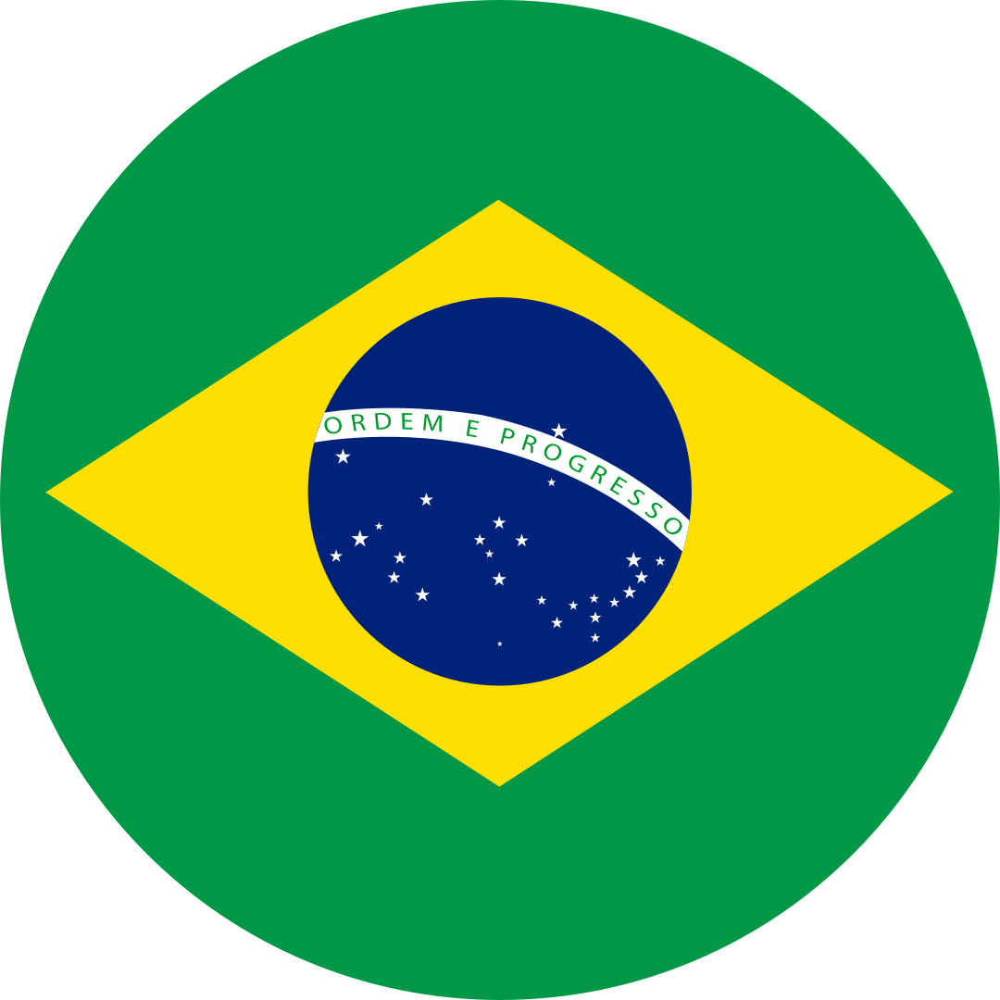
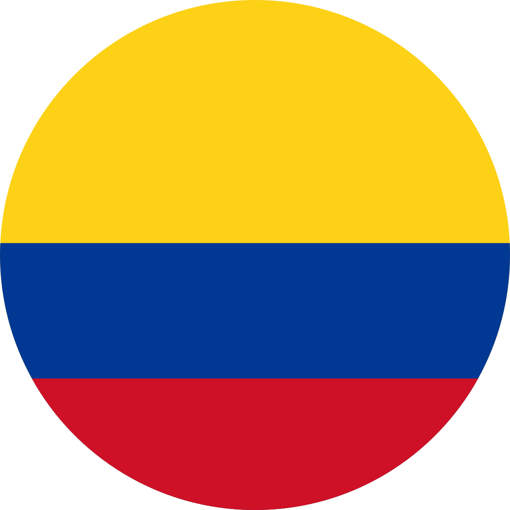
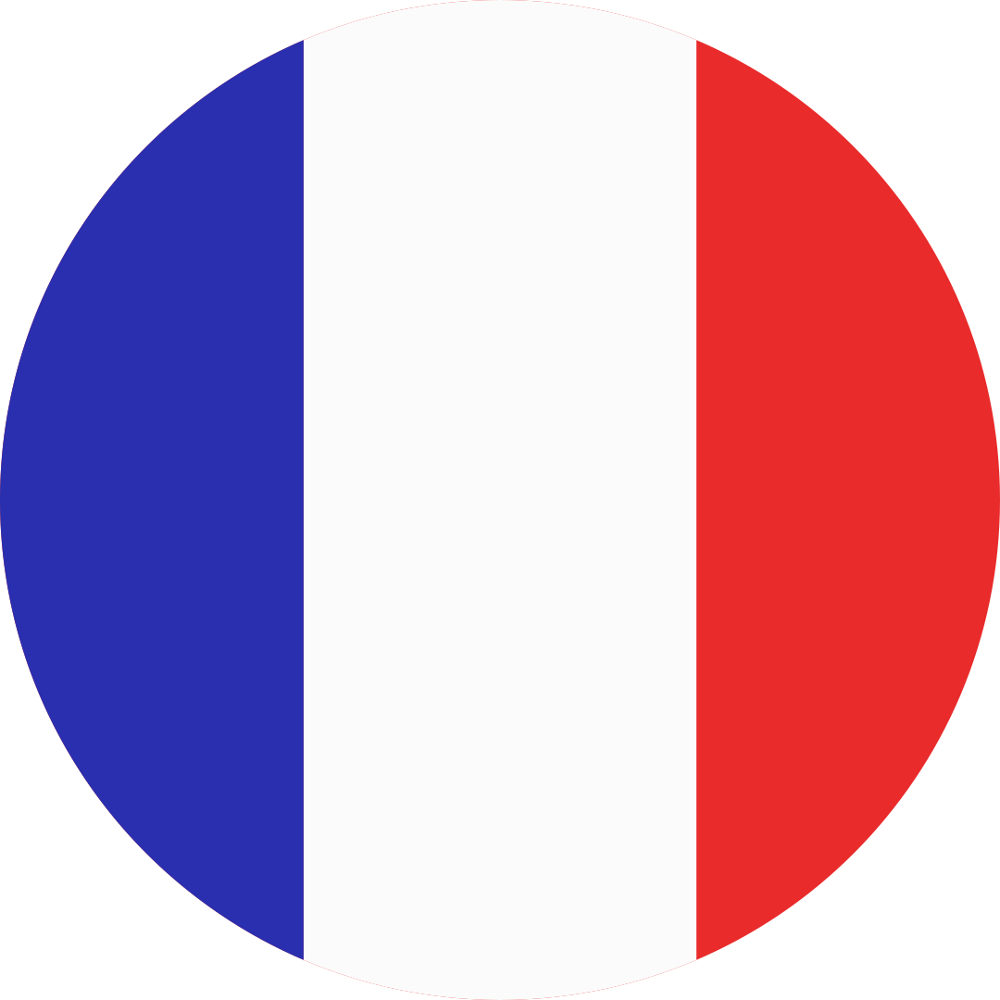
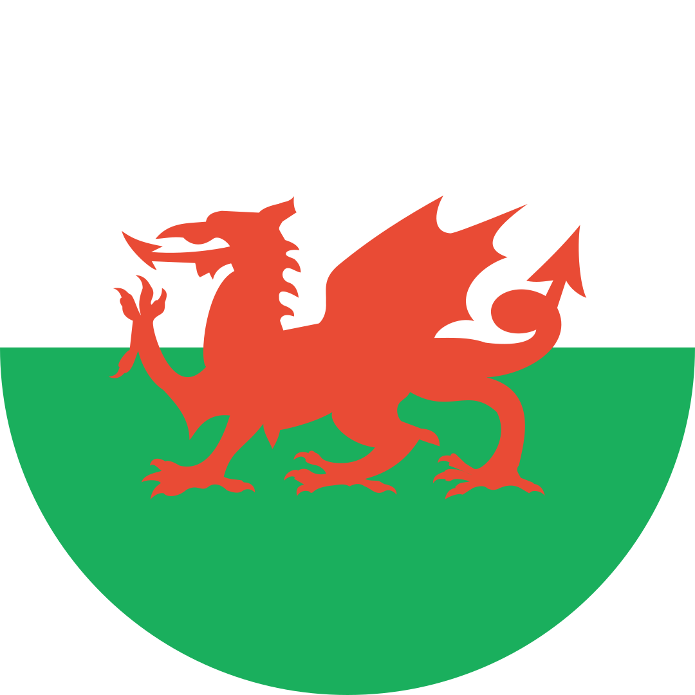
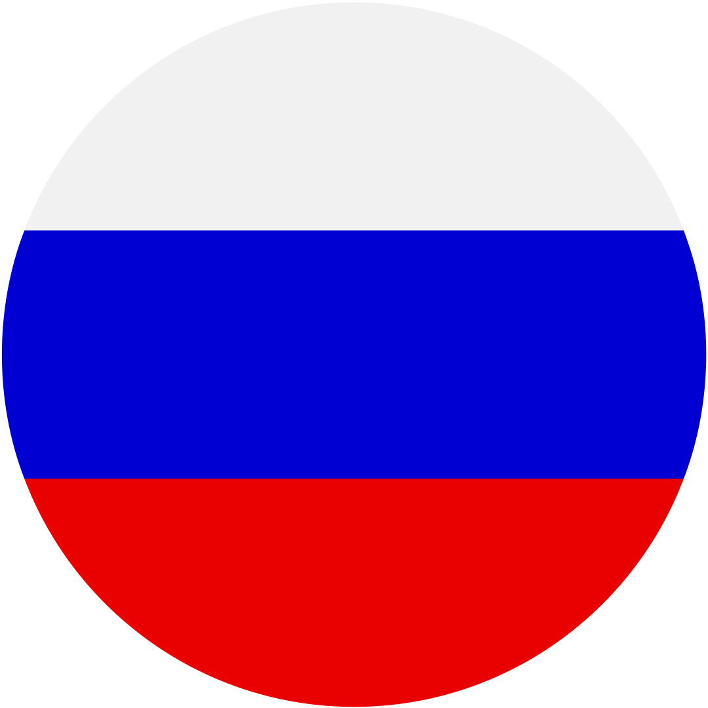

   <b>&nbsp;</b>
   <b>&nbsp;</b>
   <b>&nbsp;</b>
   <b>&nbsp;</b>
   <b>&nbsp;</b>
  

# ¿hola, cómo estás? :wave:

 

 
  
   
    soy andressa, pero todos me conocen como <b>alfa</b>, tengo 34 años, vivo en campinas
    
    soy mamá de tres gatitas preciosas ^•ﻌ•^ฅ♡ y hablo un montón de tonterías.
    
    me encanta jugar videojuegos, especialmente esos juegos de romance tan raros, 
   
    puzzles, don't starve together y stardew valley, pero ultimamente estoy
   
    viciada en animal crossing: new horizons en mi nintendo switch.
    
    estudié <b>artes visuales</b> en la unicamp, hice un curso de <b>web design</b> en el senac,
   
    una maestria en <b>ux design</b> en la anhembi morumbi y ahora estoy
   
    aprendiendo <b>python</b> en el senai y <b>node.js</b> en la alura.
    
    soy <i>roleplayer</i>, fan de <i>expediente x</i> e adicta al <i>alfajor</i> de la turma da mônica

 
 

#### 👤 Perfiles Personales y de Juegos

 

#### 🛠️ Herramientas

  
  
  
  
  
  
  
  
   

#### 🤖 Lenguajes

  
  
  
  
  
  
  
  
   
   

#### 🎨 Herramientas de UI/UX

  
  
  
  
  
  
  
  
  

   
  

  <picture>
    <source
      srcset="https://github-readme-stats.vercel.app/api/top-langs/?username=alfasou&layout=donut&theme=radical&langs_count=8" width="800px" height="300px"
      media="(prefers-color-scheme: dark), (prefers-color-scheme: no-preference)"
    />
    <source
      srcset="https://github-readme-stats.vercel.app/api/top-langs/?username=alfasou&layout=donut&theme=buefy&langs_count=8" width="800px" height="300px"
      media="(prefers-color-scheme: light)"
    />
    
  </picture>

 
