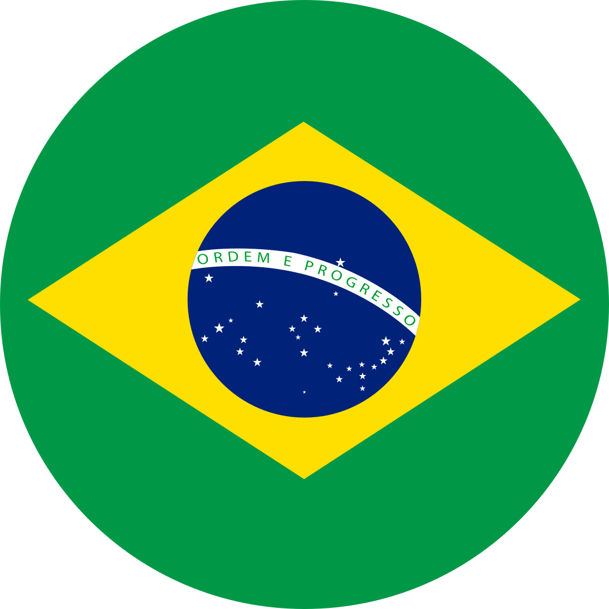
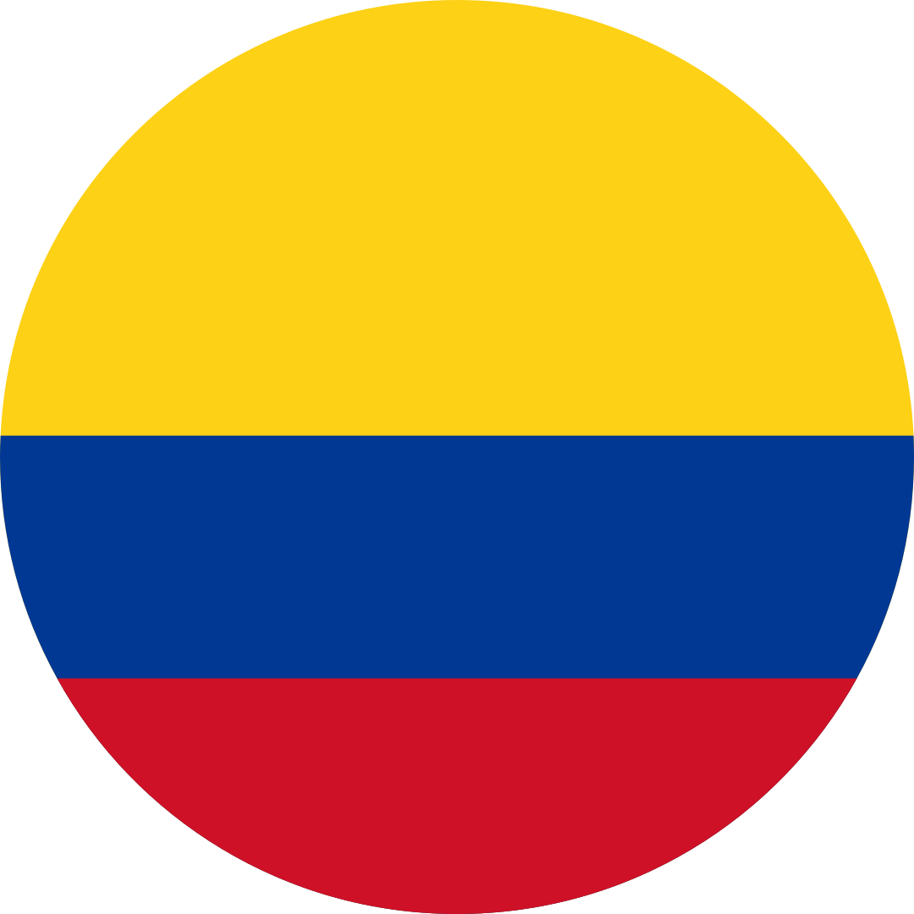
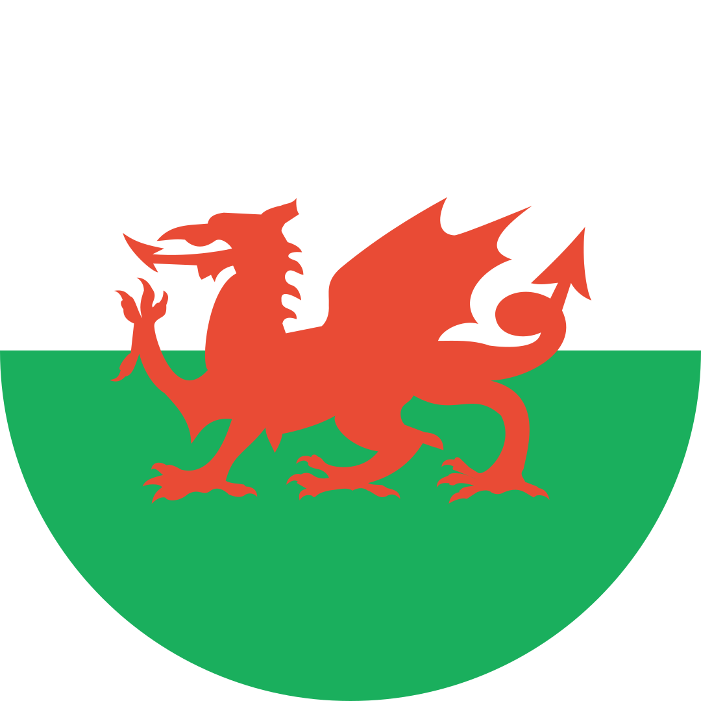

   <b>&nbsp;</b>
   <b>&nbsp;</b>
   <b>&nbsp;</b>
   <b>&nbsp;</b>
   <b>&nbsp;</b>
  

# olá, tudo bem? :wave:

 

 
  
   
    eu sou a andressa, mais conhecida como <b>alfa</b>, tenho 34 anos, 
    
    moro em campinas, tenho três gatas ^•ﻌ•^ฅ♡ e falo muita bobagem.
    
    amo jogar videogame, principalmente jogos de namoro esquisitos, 
   
    puzzles, don't starve together e stardew valley, mas ultimamente tenho jogado mais
   
    animal crossing: new horizons no meu nintendo switch.
    
    me formei em <b>artes visuais</b> na unicamp, cursei <b>webdesign</b> no senac,
   
    fiz pós-graduação em <b>ux design</b> na anhembi morumbi e 
   
    também estudei <b>python</b> no senai e <b>node.js</b> na alura.
    
    sou <i>rpgista</i>, fã de <i>arquivo x</i> e de <i>alfajor</i> da turma da mônica

 
 

#### 👤 Perfis Pessoais e de Games

 
  
  
  
  
  
  
  
   

#### 🛠️ Ferramentas

    
  
  
  _vscode-007acc?logo=visualstudiocode&logoColor=fff" alt="visual studio code" title="visual studio code">
  
  
  
  
  
   

#### 🤖 Linguagens

  
  
  
   
  
  
  
  
  
  
   

#### 🎨 Ferramentas de UI/UX

 
  
  
  
  
  
  
  
  
  

   
  

  <picture>
    <source
      srcset="https://github-readme-stats.vercel.app/api/top-langs/?username=alfasou&layout=donut&theme=radical&langs_count=8" width="800px" height="300px"
      media="(prefers-color-scheme: dark), (prefers-color-scheme: no-preference)"
    />
    <source
      srcset="https://github-readme-stats.vercel.app/api/top-langs/?username=alfasou&layout=donut&theme=buefy&langs_count=8" width="800px" height="300px"
      media="(prefers-color-scheme: light)"
    />
    
  </picture>

 
